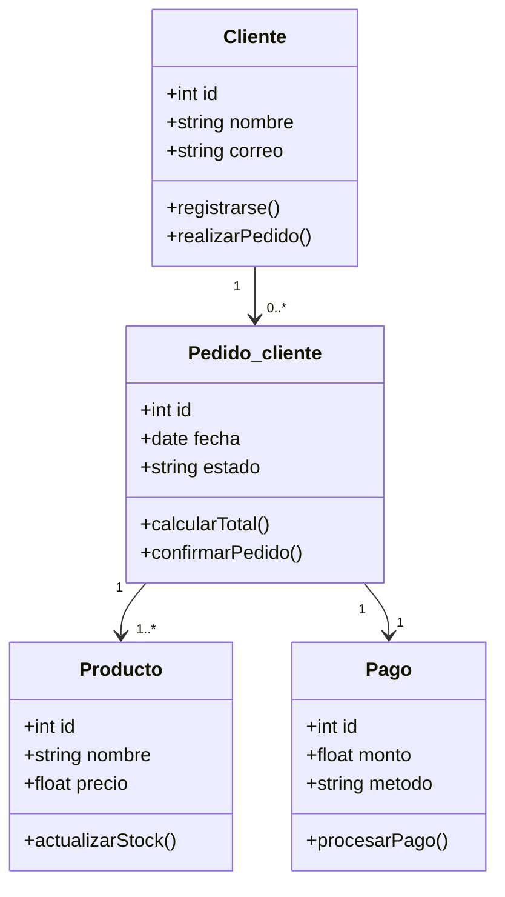

# Diagrama de clases — Sistema de pedidos

```mermaid
classDiagram
    class Cliente {
        +int id
        +string nombre
        +string correo
        +registrarse()
        +realizarPedido()
    }

    class Pedido_cliente {
        +int id
        +date fecha
        +string estado
        +calcularTotal()
        +confirmarPedido()
    }

    class Producto {
        +int id
        +string nombre
        +float precio
        +actualizarStock()
    }

    class Pago {
        +int id
        +float monto
        +string metodo
        +procesarPago()
    }

    Cliente "1" --> "0..*" Pedido_cliente
    Pedido_cliente "1" --> "1..*" Producto
    Pedido_cliente "1" --> "1" Pago
```